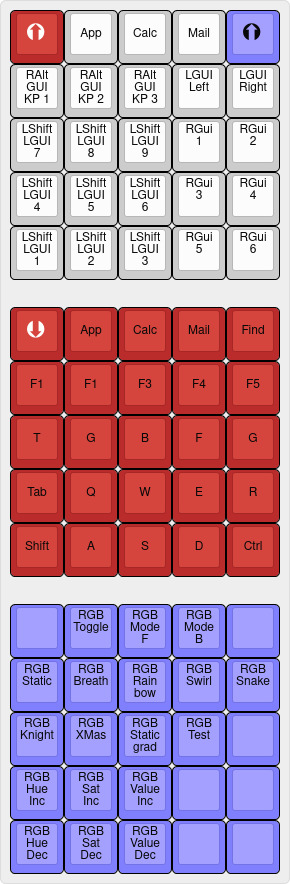

# Debroglie Lightning 25 / DZTech Winry 25tf

Another makropad from Aliexpress. 5x5 hotswap sockets with Gateron Reds, Mega32U4, per Key RGB LEDs, 8 downlights, dfu bootloader.
Current versions of QMK have that keyboard as winry/winry25tc. But not with a full LED Matrix configuration.

 - Keys: Gateron Red
 - Keycaps: Some leftovers

# Howto install:

- Copy or symlink the keymap directory to <QMK>/keyboards/winry/winry25tc/keymaps
- Copy or symlink the keyboard.json to <QMK>/keyboards/winry/winry25tc and replace the existing one
- Build and flash with qmk flash -kb winry/winry25tc -km <SYMLINKDIR>

[Layout](https://www.keyboard-layout-editor.com/##@@_c=#ba2b2b&t=#ffffff&a:7&f:9;&=%3Ci%20class/='kb%20kb-Arrows-Up-Circle-Filled'%3E%3C//i%3E&_c=#cccccc&t=#000000&f:3;&=&=Vol-&=Mute&=Vol+;&@_a:5;&=LWin%0A%0A%0A%0A%0A%0A1&=LWin%0A%0A%0A%0A%0A%0A2&=LWin%0A%0A%0A%0A%0A%0A3&=LWin%0A%0A%0A%0A%0A%0A4&=LWin%0A%0A%0A%0A%0A%0A5;&@_a:7;&=PgDn&=Home&=Up&=End&=PgUp;&@_a:5;&=Shift%0AA%0A%0A%0A%0A%0ALWin&_a:7;&=Left&=Down&=Right&_a:5;&=Shift%0AS%0A%0A%0A%0A%0ALWin;&@=LWin%0A%0A%0A%0A%0A%0AA&=LWin%0A%0A%0A%0A%0A%0AA&_a:7;&=&_a:5;&=Lwin%0A%0A%0A%0A%0A%0AS&=Lwin%0A%0A%0A%0A%0A%0AS;&@_y:0.5&c=#ba2b2b&t=#ffffff&a:7&f:9;&=%3Ci%20class/='kb%20kb-Arrows-Down-Circle-Filled'%3E%3C//i%3E&_t=#000000&f:3;&=&=&=&=;&@=&=&=&=&=;&@_a:5;&=Matrix%0A%0A%0A%0A%0A%0AToggle&=Matrix%0A%0A%0A%0A%0A%0APrev&=Matrix%0A%0A%0A%0A%0A%0ANext&_a:7;&=&=;&@_a:5;&=Matrix%0AUp%0A%0A%0A%0A%0AHue&=Matrix%0AUp%0A%0A%0A%0A%0ASat&=Matrix%0AUp%0A%0A%0A%0A%0AValue&=Matrix%0AUp%0A%0A%0A%0A%0ASpeed&_a:7;&=;&@_a:5;&=Matrix%0ADown%0A%0A%0A%0A%0ASat&=Matrix%0ADown%0A%0A%0A%0A%0ASat&=Matrix%0ADown%0A%0A%0A%0A%0AValue&=Matrix%0ADown%0A%0A%0A%0A%0ASpeed&_a:7;&=)
